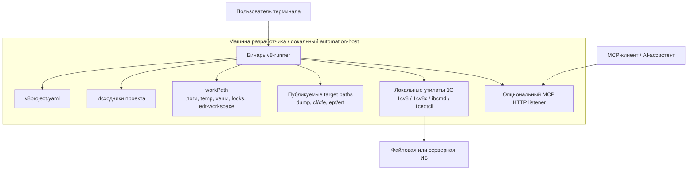

## 7. Представление развёртывания

Основная цель развёртывания — одна рабочая станция разработчика или локальный automation-host с доступом к файловой системе и установленными утилитами 1С.

Предположения по развёртыванию:

- процесс может запускать дочерние процессы;
- настроенный `workPath` доступен на запись;
- деревья исходников доступны локально, а целевая ИБ доступна как файловая база или как серверное подключение;
- workspace lock является local advisory file lock внутри `workPath`, а не distributed lock для нескольких машин;
- full replacement staging/backup paths создаются рядом с target path, поэтому parent directory target должен быть доступен на запись;
- отдельный database service самому `v8-runner` не нужен;
- HTTP listener нужен только для MCP transport и не участвует в обычном CLI path;
- HTTP session capacity ограничивает stateful MCP sessions, но не является лимитом внешних platform processes.
