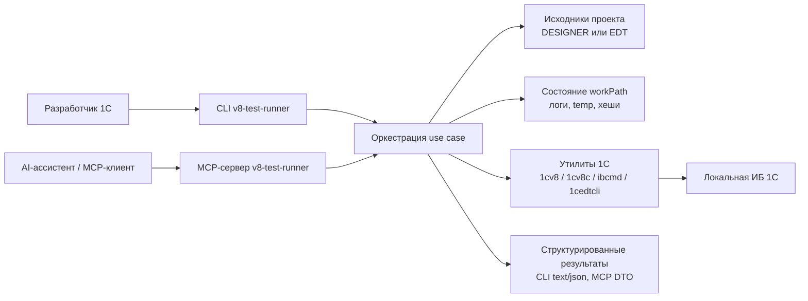
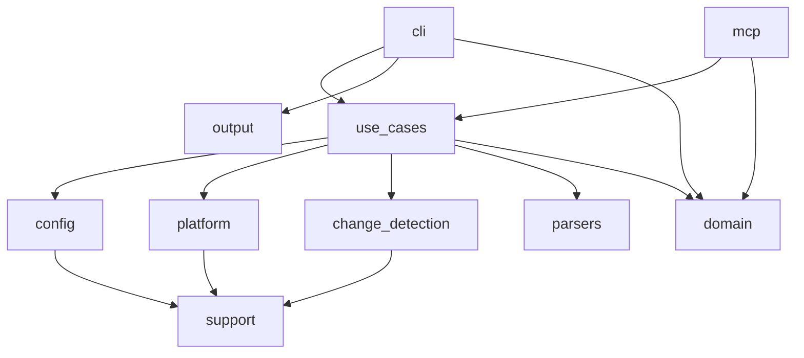
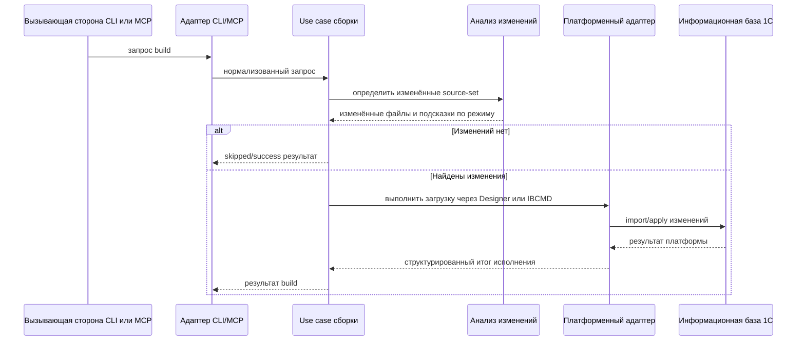
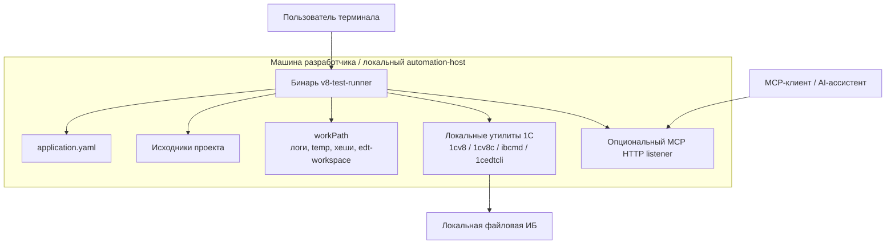

# Архитектурная документация arc42

## 1. Введение и цели

### 1.1 Назначение

`v8-test-runner` — это локальный инструмент на Rust для автоматизации типовых операций разработки на 1С через два публичных интерфейса:

- CLI для прямой работы из терминала;
- MCP-сервер для AI-ассистентов по stdio и streamable HTTP.

Система сокращает ручную работу вокруг загрузки исходников в информационную базу, запуска YaXUnit-тестов, выгрузки изменений обратно в файлы, синтаксических проверок и запуска утилит 1С.

### 1.2 Заинтересованные стороны

| Стейкхолдер | Интерес |
| --- | --- |
| Разработчики 1С | Быстрые локальные сценарии `build`, `test`, `dump`, `syntax` и `launch` |
| AI-ассистенты / MCP-клиенты | Стабильный и структурированный интерфейс автоматизации с предсказуемыми ошибками |
| Мейнтейнеры | Чёткие границы модулей, расширяемые адаптеры и тестируемая оркестрация |
| Технические лиды | Зафиксированная матрица возможностей, ограничений и эксплуатационных правил |

### 1.3 Цели по качеству

| Приоритет | Цель | Почему это важно |
| --- | --- | --- |
| 1 | Предсказуемое поведение автоматизации | Инструмент используется как граница исполнения для ассистентов и локальных скриптов |
| 2 | Быстрые инкрементальные сценарии | Крупные 1С-проекты не должны всегда требовать полный rebuild |
| 3 | Структурированная диагностика | Пользователям CLI и MCP нужны пригодные к действию ошибки, а не только сырые логи |
| 4 | Разделение ответственности | CLI, MCP, use case и платформенные адаптеры должны развиваться независимо |
| 5 | Эксплуатационная безопасность | Параллелизм, таймауты и лимиты сессий должны ограничивать внешнее выполнение |

### 1.4 Область действия

Входит в область действия:

- локальная автоматизация разработки на 1С;
- оркестрация внешних утилит 1С;
- общая бизнес-логика для CLI и MCP;
- конфигурация, анализ изменений, парсинг результатов и телеметрия исполнения.

Не входит в область действия:

- удалённая оркестрация на нескольких хостах;
- браузерный UI;
- полноценное управление CI/CD-конвейером;
- замена нативных утилит платформы 1С.

## 2. Ограничения

### 2.1 Технические ограничения

- Кодовая база реализована на Rust 2021.
- Ключевые интеграции зависят от локально доступных утилит 1С: `1cv8`, `1cv8c`, `ibcmd` и `1cedtcli`.
- `format=EDT` сейчас требует `builder=DESIGNER`.
- `builder=IBCMD` требует файловое подключение к информационной базе.
- MCP реализован на `rmcp`, `tokio` и `axum`.
- Состояние отслеживания изменений хранится в `workPath/hash-storages/*.redb`.

### 2.2 Организационные и продуктовые ограничения

- Инструмент ориентирован на локальное использование и предполагает рабочую станцию разработчика.
- Публичное поведение должно соответствовать текущим контрактам CLI и MCP, а не старым внутренним заметкам.
- Ответы MCP должны оставаться структурированными и пригодными для автоматизации.
- В проекте уже разведены пользовательские эксплуатационные документы и внутренняя архитектурная документация для контрибьюторов.

## 3. Контекст и границы системы

### 3.1 Бизнес-контекст

Система находится между деревом исходников, локальными рантаймами 1С и потребителями автоматизации. Она стандартизирует типовые сценарии в более узкий и управляемый интерфейс по сравнению с прямым вызовом утилит.

### 3.2 Технический контекст

Внешние интерфейсы:

- аргументы CLI и вывод в text/JSON;
- вызовы MCP tool по stdio и streamable HTTP;
- YAML-конфигурация;
- доступ к файловой системе для исходников проекта и `workPath`;
- запуск дочерних процессов для локальных утилит 1С.

### 3.3 Граница системы

Внутри границы:

- нормализация запросов;
- валидация конфигурации;
- оркестрация сценариев `build` / `test` / `dump` / `syntax` / `launch` / `init`;
- парсинг результатов тестов и синтаксических проверок;
- обработка транспортов и сессий MCP;
- анализ изменений и управление временными артефактами.

За пределами границы:

- реальное поведение компилятора и рантайма 1С;
- внутреннее устройство YaXUnit;
- планирование процессов операционной системой;
- установка и жизненный цикл локальных утилит 1С.

## 4. Стратегия решения

Архитектура следует слоистой модели оркестрации.

Ключевые решения в текущей реализации:

- CLI и MCP остаются тонкими адаптерами над транспортно-нейтральными use case.
- Прямое взаимодействие с инструментами 1С инкапсулировано в выделенных платформенных адаптерах.
- Анализ изменений используется для предпочтения инкрементальной работы вместо полного rebuild.
- Структурированные типы результатов сохраняются до границы адаптера, а затем рендерятся отдельно для CLI и MCP.
- MCP рассматривается не только как транспорт: он добавляет сессии, параллелизм, нормализацию и обработку транспортных ошибок.
- Общая интерактивная EDT-сессия переиспользуется только для живого пути MCP `check_syntax_edt`, а остальные EDT-сценарии пока остаются one-shot.

Эта стратегия удерживает публичную поверхность стабильной и позволяет независимо развивать платформенное поведение и транспортные правила.

## 5. Представление строительных блоков

### 5.1 Уровень 1

Система организована в следующие крупные блоки:

- `cli`: разбор аргументов и CLI-специфичное представление результатов.
- `config`: загрузка и валидация YAML.
- `use_cases`: транспортно-нейтральная оркестрация и контекст выполнения.
- `mcp`: MCP DTO, сервисная граница, транспорты, параллелизм и управление сессиями.
- `platform`: поиск внешних инструментов и выполнение команд против утилит 1С.
- `change_detection`: инкрементальный анализ и сохранённое файловое состояние.
- `parsers`: преобразование сырых логов и отчётов в структурированные результаты.
- `domain` и `output`: общие модели результатов и CLI-примитивы представления.
- `support`: сквозные утилиты для файловой системы, логирования, temp и ошибок.

### 5.2 Уровень 2

#### `cli`

- Преобразует аргументы `clap` в транспортно-нейтральные запросы.
- Отвечает за разбор аргументов и CLI-специфичный рендеринг результатов.

#### `use_cases`

- Центральная оркестрация для `init`, `build`, `test`, `dump`, `syntax` и `launch`.
- Определяет контракты запросов и результатов, общие для CLI и MCP.

#### `mcp`

- Преобразует MCP tool-запросы в запросы use case.
- Публикует восемь текущих MCP-инструментов.
- Обрабатывает stdio- и HTTP-транспорты, трекинг сессий, лимиты параллелизма и общий EDT actor-path.

#### `platform`

- Разрешает расположение инструментов.
- Строит аргументы подключения.
- Выполняет команды Designer, Enterprise, IBCMD и EDT.

#### `change_detection`

- Сканирует деревья исходников.
- Отслеживает хеши и timestamp.
- Группирует изменения по логическим `source-set`.

#### `parsers`

- Парсит JUnit XML, YaXUnit-логи, логи Designer validation и вывод EDT validation в структурированные результаты.

## 6. Представление времени выполнения

### 6.1 Сценарий `build`

Ключевые свойства выполнения:

- `CONFIGURATION` обрабатывается раньше расширений.
- Выбор между partial и full строится по анализу изменений и возможностям backend.
- Состояние сохраняется только после успешного выполнения.

### 6.2 Сценарий `test`

- `test` всегда начинается с `build`.
- Если сборка завершилась ошибкой, тесты не запускаются.
- Генерируется временный JSON-конфиг YaXUnit.
- Затем запускается Enterprise, а JUnit XML и YaXUnit-логи разбираются в структурированные результаты.

### 6.3 Сценарий MCP EDT Syntax

- MCP-запрос приходит через stdio или HTTP.
- Глобальный admission control ограничивает параллельные tool-вызовы.
- `check_syntax_edt` идёт через общий менеджер EDT-сессии вместо one-shot исполнения.
- Ожидание в очереди, baseline reset/probe и выполнение команды используют один и тот же ограниченный бюджет таймаута.

## 7. Представление развёртывания

Основная цель развёртывания — одна рабочая станция разработчика или локальный automation-host с доступом к файловой системе и установленными утилитами 1С.

Предположения по развёртыванию:

- процесс может запускать дочерние процессы;
- настроенный `workPath` доступен на запись;
- деревья исходников и пути к ИБ доступны локально;
- отдельный database service самому `v8-test-runner` не нужен.

## 8. Сквозные концепции

### 8.1 Модель конфигурации

- `application.yaml` — главный входной контракт.
- Валидация конфигурации заранее отклоняет неподдерживаемые комбинации.
- `source-set` — базовая единица оркестрации.

### 8.2 Анализ изменений

- Сканирование файлов использует фильтрацию по timestamp с последующей проверкой хеша.
- Состояние изолировано по логическим `source-set`.
- При сбоях система предпочитает безопасную деградацию, а не тихую потерю данных.

### 8.3 Обработка ошибок и результаты

- Use case возвращают структурированные результаты или структурированные ошибки.
- CLI и MCP определяют представление на границе адаптера.
- MCP различает бизнес-ошибки и внутренние/runtime-сбои.

### 8.4 Наблюдаемость

- Логи и сгенерированные артефакты хранятся под `workPath`.
- Телеметрия MCP публикуется как структурированные tracing-события, а не через отдельный metrics-backend.

### 8.5 Параллелизм и таймауты

- MCP tool-вызовы используют общие admission-лимиты.
- HTTP MCP-сессии ограничены по ёмкости и управляются через TTL.
- Для интерактивного EDT-исполнения заданы отдельные ограничения на startup и command timeout.

## 9. Архитектурные решения

Существующие ADR-файлы: на момент написания документа в репозитории не найдены.

Важные уже реализованные решения, которые сейчас зафиксированы кодом и внутренними архитектурными заметками:

- транспортно-нейтральные контракты use case, общие для CLI и MCP;
- отдельные платформенные адаптеры для Designer, Enterprise, IBCMD и EDT;
- общий интерактивный EDT actor ограничен MCP EDT syntax, а не всеми EDT-операциями;
- поддержка `builder=IBCMD` ограничена файловыми ИБ;
- сохранённое инкрементальное состояние хранится в `redb`.

Рекомендуемое развитие:

- фиксировать эти решения в явных ADR, когда они меняются или когда добавляются новые backend/transport.

## 10. Требования к качеству

### 10.1 Дерево качества

- Функциональная пригодность
  - команды и MCP-tools должны отражать реально поддерживаемые комбинации возможностей;
- Надёжность
  - ошибки должны быть явными, структурированными и по возможности восстановимыми;
- Производительность
  - инкрементальные rebuild и выборочный export должны сокращать лишнюю работу;
- Сопровождаемость
  - границы модулей должны удерживать адаптеры и оркестрацию разделёнными;
- Эксплуатационная пригодность
  - логи, временные артефакты и настройки сессий должны делать сбои диагностируемыми.

### 10.2 Сценарии качества

| ID | Сценарий | Ожидаемое поведение |
| --- | --- | --- |
| Q-1 | Разработчик запускает `build` после небольшого изменения в одном `source-set` | Система определяет только релевантные изменения и выбирает partial-режим, когда это допустимо |
| Q-2 | MCP-клиент отправляет некорректные или неподдерживаемые флаги syntax | Запрос отклоняется с понятной структурированной валидацией, а не уходит в неопределённое выполнение |
| Q-3 | Интерактивная EDT syntax-проверка зависает | Общий actor применяет ограниченные таймауты и при необходимости перезапускает/дренирует сессию |
| Q-4 | Тестовый прогон падает до полного парсинга отчётов | Диагностические артефакты сохраняются в `workPath/temp/yaxunit/` для расследования |
| Q-5 | HTTP MCP достигает лимита по числу сессий | Новые `initialize`-запросы детерминированно отклоняются, а не перегружают ёмкость |

## 11. Риски и технический долг

- Набор ADR пока отсутствует, поэтому ключевые решения описаны в коде и прозе, но не оформлены как управляемый журнал решений.
- Публичная и внутренняя документация могут расходиться, если их не обновлять вместе с кодом.
- Общий интерактивный EDT-путь покрывает только MCP syntax, что создаёт осознанное разделение EDT-режимов выполнения.
- Поддержка `IBCMD` остаётся уже, чем поддержка Designer.
- Система сильно зависит от локальных внешних инструментов и корректности окружения, что ограничивает герметичное тестирование.
- Многошаговые сценарии вроде build по нескольким `source-set` намеренно не являются атомарными.

## 12. Глоссарий

| Термин | Значение |
| --- | --- |
| 1С | Локальная корпоративная платформа и утилиты, которыми управляет система |
| Designer | Конфигуратор 1С и соответствующий формат исходников / backend |
| EDT | 1C:Enterprise Development Tools и формат EDT-проектов |
| MCP | Model Context Protocol, через который ассистенты вызывают инструменты |
| `source-set` | Логическая группа исходников, либо `CONFIGURATION`, либо `EXTENSION` |
| YaXUnit | Фреймворк тестирования, используемый для запуска и отчётности по unit-тестам 1С |
| `workPath` | Каталог времени выполнения для логов, temp-файлов, состояния и сгенерированных артефактов |
| IBCMD | Командная утилита 1С, используемая как альтернативный backend для части операций |
| Структурированная бизнес-ошибка | Контролируемая ошибка, возвращаемая как часть контракта CLI/MCP-операции |
